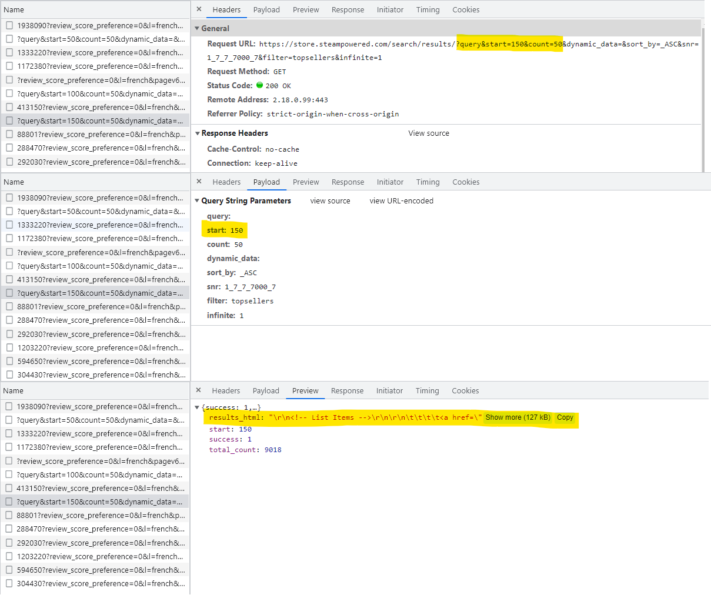
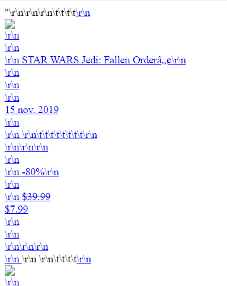

## Advanced Web Scraping with Python using Scrapy & Splash

- [**Centris Project**](#Centric-Canada)
    - [Setup](#Setup)
    - [Understand the API](#Understand-the-API)
    - [Connect to the API](#Connect-to-the-API)
    - [GET DATA (HTML Format) from the API](#GET-DATA-from-the-API)
    - [Use optimize Splash](#Use-optimize-Splash)
    - [AQUARIUM](#AQUARIUM)
- [**Steam Project**](#Steam-Project)
  - [Try to consume the API](#Try-to-consume-the-API)
  - [GET Data Directly from browser](#GET-Data-Directly-from-browser)
  - [Pagination](#Pagination)
  - [Limit Item Scraped](#Limit-Item-Scraped)
  - [Working with Items](#Working-with-Items)
  - [ScrapyRT](#ScrapyRT)
- [**Zillow Project**](#Zillow-Project)
  - [Cookies](#Cookies)
  - [Pagination From Payload](#Pagination-From-Payload)

## Centric Canada

### Setup
1- Create scrapy folder
```shell
scrapy startproject centris
```

2- create genspider
```shell
scrapy genspider listings www.centris.ca/en
```

3- Modify `User Agent` in `settings.py`
```python
USER_AGENT = 'Mozilla/5.0 (Windows NT 10.0; Win64; x64) AppleWebKit/537.36 (KHTML, like Gecko) Chrome/86.0.4240.183 Safari/537.36'
ROBOTSTXT_OBEY = False
```
***

### Understand the API

1- After searching for **Montréal** in `inspecter` for www.centris.ca, we will find 2 POST API :

- UpdateQuery
- GetInscriptions

GetInscriptions is the API to send HTML to server + count of Home
UpdateQuery is the API send to server to filter the count

When we open `Postman` and send to the API of GetInscriptions :

1- `POST` to `https://www.centris.ca/Property/GetInscriptions`

2- In `Body` send as row text the `Payload` \ `Request Payload` \ `view source`

3- In `Headers` **KEY :** `Content-Type` , **VALUE :** `application/json`

=> In response `Body`, we will found `"count" : 310510`

    That mean the server send all query (not filtered)
    So we need to use the UpdateQuery API before GetInscriptions

To do that :

1- `POST` to `https://www.centris.ca/property/UpdateQuery`

2- In `Body` send as row text the `Payload` \ `Request Payload` \ `view source`

3- In `Headers` **KEY :** `Content-Type` , **VALUE :** `application/json`

    like That we send the query of what we need to search, then we can get from 
    GetInscriptions the result (by send POST request)
***
### Connect to the API

Once we have the search API (query) and the final API, 
all we need is to connect to these APIs

- Connect to the Search API :

```python
import scrapy

def start_requests(self):
    # On the second page of search we have UpdateQuery, query is the Request Payload (view source)
    query = {...}
    yield scrapy.Request(
        url="https://www.centris.ca/property/UpdateQuery", method="POST", body=json.dumps(query),
        headers={'Content-type': 'application/json'}, callback=self.update_query
        )

```
- Connect to final API :

```python
import scrapy

position = {"startPosition": 0}
def update_query(self, response):
    yield scrapy.Request(
        url="https://www.centris.ca/Property/GetInscriptions", method="POST", body=json.dumps(self.position),
        headers={'Content-type': 'application/json'}, callback=self.parse
    )
```
***

### GET DATA from the API

As the data is stored in the server in HTML format


To consume the API, 
we need first to get this data (in HTML Format) 

```python
from scrapy.selector import Selector
import json

def parse(self, response, **kwargs):
    resp_dict = json.loads(response.body)

    # to get the HTML response we go in GetInscriptions / Preview -> d: Result : html
    html = resp_dict.get('d').get('Result').get('html')
    print(html)
    with open('index.html', 'w') as f:
        f.write(html)

    sel = Selector(text=html)     # convert string to selector object so we can use xpath
```
### Use optimize Splash

If we can't find the API we must use scrapy-splash, and for a big project we need to
optimize splash by disabling **CSS, JS and Image**

```python
    script = """
            function main(splash, args)
              splash:on_request(function(request)
                if request.url:find('css') then
                    request.abort()
                end
              end)
              splash.js_enabled = false
              splash.images_enabled = false
              assert(splash:go(args.url))
              assert(splash:wait(0.5))
              return splash:html()
            end
    """
```
## AQUARIUM

**AQUARIUM** allow us to create a cluster of splash instances

So instead of running one Splash instance, we can run multiple Splash instance at once

The website of aquarium : [https://github.com/TeamHG-Memex/aquarium](https://github.com/TeamHG-Memex/aquarium)

1- Install aquarium :

```shell
pip install cookiecutter
```

2- Copy this shell to the project folder :

````shell
cookiecutter gh:TeamHG-Memex/aquarium
````

all value will be set by default except :

- splash-version [3.0] : **latest**
- tor [1] : **0**

3- To install AQUARIUM in the Docker Desktop:
```shell
cd aquarium
docker-compose up
```
4- In Google Chrome, the address is : **localhost:8050**

- user : **user** 
- pass : **userpass**

To see how many Splash is running we can go to : **localhost:8036**

- user : **admin** 
- pass : **adminpass**

5- To use AQUARIUM in our project we have to use 

**`splash_headers={'Authorization': basic_auth_header('user', 'userpass')}`**:

```python
from scrapy_splash import SplashRequest
from w3lib.http import basic_auth_header

def parse(self, response, **kwargs):
    yield SplashRequest(
        url=url, endpoint='execute', callback=self.parse_summary, 
        args={'lua_source': self.script},
        splash_headers={'Authorization': basic_auth_header('user', 'userpass')},
        meta={
            'cat': category, 'add': address, 'pla': place, 
            'cur': currency, 'pri': price
            }
        )
```
***
## Steam Project

### Try to consume the API



After locate the API, we try to connect

```python
import scrapy

def start_requests(self):
    yield scrapy.Request(
        url="https://store.steampowered.com/search/results/?query&start=0&count=50&dynamic_data="
            "&sort_by=_ASC&snr=1_7_7_7000_7&filter=topsellers&infinite=1", 
        method="GET", 
        headers={'X-Requested-With': 'XMLHttpRequest', 'X-Prototype-Version': '1.7'},
        callback=self.parse,
        meta={'start': 0}
        )
```

but after we connect to API

```python
import json
from scrapy import Selector

def parse(self, response, **kwargs):
    response_dict = json.loads(response.body)
    my_html = response_dict.get('results_html')
    html_selector = Selector(text=my_html)
```
The HTML response is like that



--> So **we can't extract anything** from the API
***
### GET Data Directly from browser

- Since we are getting response from GET method, 
we can scrape data directly from web browser

- Before jump directly to second method, let's first analyse
the URL of steam 

`https://store.steampowered.com/search/?filter=topsellers`

if we add `&page=1` we have a webpage like that:


--> Now we can handle pagination
***

### Pagination

To handle the pagination, in the xpath expression we have to use 
`@class='pagebtn' and text()='>'` to target next page button

```python
next_page = response.xpath("//a[@class='pagebtn' and text()='>']/@href").get()

if next_page:
  yield scrapy.Request(url=next_page, callback=self.parse)
```
***
### Limit Item Scraped

To limit the number or Item to scrap at 100, we have to go at `settings.py`
and  add:

```python
CLOSESPIDER_ITEMCOUNT = 100
```
***

### Working with Items

The spider-class (BestSellingSpider) itself should only responsible for following links
and return data back to us

So all methods and functions witch are responsible for processing some field we have should
not leave in spider-class itself but should be moved in `items.py`

- So in the spider-class we should use an item loader class (it just load class we defined in item.py)
```python
from scrapy.loader import ItemLoader
from ..items import SteamItem
import scrapy


class BestSellingSpider(scrapy.Spider):
    name = 'best_selling'
    allowed_domains = ['store.steampowered.com']
    start_urls = [f'https://store.steampowered.com/search/?filter=topsellers&page=1']

    def parse(self, response, **kwargs):
        games = response.xpath("//div[@id='search_resultsRows']/a")
        for game in games:
            loader = ItemLoader(item=SteamItem(), selector=game, response=response)
            loader.add_xpath('game_url', ".//@href")
            loader.add_xpath('img_url', ".//div[@class='col search_capsule']/img/@src")
            loader.add_xpath('game_name', ".//span[@class='title']/text()")
            loader.add_xpath('release_date', ".//div[contains(@class, 'col search_released')]/text()")
            loader.add_xpath('platforms', ".//span[@class='vr_supported' or contains(@class, 'platform_img')]/@class")
            loader.add_xpath('reviews_summary', ".//span[contains(@class, 'search_review_summary')]/@data-tooltip-html")
            loader.add_xpath('discount_rate', ".//div[contains(@class, 'search_discount')]/span/text()")
            loader.add_xpath('original_price', ".//div[contains(@class, 'search_price_discount_combined')]")
            loader.add_xpath('discount_price', "(.//div[contains(@class, 'search_price discounted')]/text())[2]")
            yield loader.load_item()

        next_page = response.xpath("//a[@class='pagebtn' and text()='>']/@href").get()
        if next_page:
            yield scrapy.Request(url=next_page, callback=self.parse)
```

-  In `items.py` we need de define all items and functions we use in our data processing
```python
import scrapy
from scrapy.loader.processors import TakeFirst, MapCompose, Join


def remove_html(review_summary):
    pass

def get_platforms(one_classes):
    pass

def get_original_price(html_markup):
    pass

def clean_discount_rate(discount_rate):
    pass

def clean_discount_price(discount_price):
    pass

class SteamItem(scrapy.Item):
    game_url = scrapy.Field(output_processor=TakeFirst())  
    # output_processor=TakeFirst() convert a list to string
    img_url = scrapy.Field(output_processor=TakeFirst())
    game_name = scrapy.Field(output_processor=TakeFirst())
    release_date = scrapy.Field(output_processor=TakeFirst())
    platforms = scrapy.Field(input_processor=MapCompose(get_platforms))
    reviews_summary = scrapy.Field(input_processor=MapCompose(remove_html),
                                   output_processor=TakeFirst()
                                   )
    original_price = scrapy.Field(input_processor=MapCompose(get_original_price, str.strip),
                                  output_processor=Join('')
                                  )
    discount_price = scrapy.Field(input_processor=MapCompose(clean_discount_price),
                                  output_processor=TakeFirst()
                                  )
    discount_rate = scrapy.Field(input_processor=MapCompose(clean_discount_rate),
                                 output_processor=TakeFirst()
                                 )

```
***

### ScrapyRT

- To see the result on the browser, we can use scrapyRT

```shell
pip install scrapyrt
```

- To run scrapyRT :
  - `scrapy -p 9000`
  - Open Chrome : `127.0.0.1:9000/crawl.json?start_requests=true&spider_name=best_selling`
- To limit the number of Items, in `settings.py`:

```python
CLOSESPIDER_ITEMCOUNT = 100
HTTPCACHE_ENABLE = True
HTTPCACHE_EXPIRATION_SECS = 3600
```
***
## Zillow Project

### Cookies

To fetch an api we need the links of that api and also the cookies. 

Best practice is to define a function where we insert the entire cookie, 
and it will convert to a cookie request

```python
from http.cookies import SimpleCookie

def cookie_parser():
    cookie_string = "zguid=24|%2412f6bae2-de68-4071-a705-8a475e662535 ......"
    cookie = SimpleCookie()
    cookie.load(cookie_string)
    cookies = {}
    for key, morsel in cookie.items():
        cookies[key] = morsel.value
    return cookies
```
***
### Pagination From Payload

To extract the pagination from Payload and inject it into the URL we use this function

```python
from urllib.parse import urlparse, parse_qs, urlencode
import json

def parse_new_url(url, page_number):
    url_parsed = urlparse(url)
    query_string = parse_qs(url_parsed.query)
    search_query_state = json.loads(query_string.get('searchQueryState')[0])
    search_query_state['pagination'] = {"currentPage": page_number}
    query_string.get('searchQueryState')[0] = search_query_state
    encoded_qs = urlencode(query_string, doseq=1)
    new_url = f"https://www.zillow.com/search/GetSearchPageState.htm?{encoded_qs}"
    return new_url
```
***
