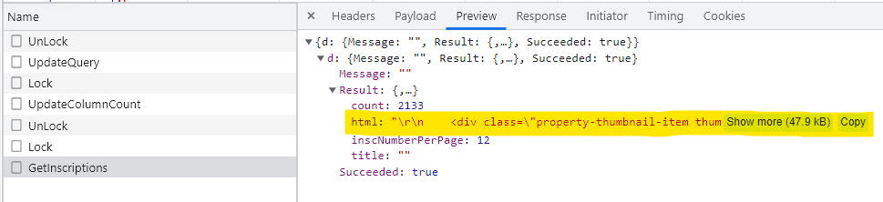

# Advanced Web Scraping with Python using Scrapy & Splash

- [**Centris Project**](#Centric-Canada)
    - [Setup](#Setup)
    - [Understand the API](#Understand-the-API)
    - [Connect to the API](#Connect-to-the-API)
    - [GET DATA (HTML Format) from the API](#GET-DATA-(HTML-Format)-from-the-API)

## Centric Canada

### Setup
1- Create scrapy folder
```shell
scrapy startproject centris
```

2- create genspider
```shell
scrapy genspider listings www.centris.ca/en
```

3- Modify `User Agent` in `settings.py`
```python
USER_AGENT = 'Mozilla/5.0 (Windows NT 10.0; Win64; x64) AppleWebKit/537.36 (KHTML, like Gecko) Chrome/86.0.4240.183 Safari/537.36'
ROBOTSTXT_OBEY = False
```
***

### Understand the API

1- After searching for **Montréal** in `inspecter` for www.centris.ca, we will find 2 POST API :

- UpdateQuery
- GetInscriptions

GetInscriptions is the API to send HTML to server + count of Home
UpdateQuery is the API send to server to filter the count

When we open `Postman` and send to the API of GetInscriptions :

1- `POST` to `https://www.centris.ca/Property/GetInscriptions`

2- In `Body` send as row text the `Payload` \ `Request Payload` \ `view source`

3- In `Headers` **KEY :** `Content-Type` , **VALUE :** `application/json`

=> In response `Body`, we will found `"count" : 310510`

    That mean the server send all query (not filtered)
    So we need to use the UpdateQuery API before GetInscriptions

To do that :

1- `POST` to `https://www.centris.ca/property/UpdateQuery`

2- In `Body` send as row text the `Payload` \ `Request Payload` \ `view source`

3- In `Headers` **KEY :** `Content-Type` , **VALUE :** `application/json`

    like That we send the query of what we need to search, then we can get from 
    GetInscriptions the result (by send POST request)
***
### Connect to the API

Once we have the search API (query) and the final API, 
all we need is to connect to these APIs

- Connect to the Search API :

```python
import scrapy

def start_requests(self):
    # On the second page of search we have UpdateQuery, query is the Request Payload (view source)
    query = {...}
    yield scrapy.Request(
        url="https://www.centris.ca/property/UpdateQuery", method="POST", body=json.dumps(query),
        headers={'Content-type': 'application/json'}, callback=self.update_query
        )

```
- Connect to final API :

```python
import scrapy

position = {"startPosition": 0}
def update_query(self, response):
    yield scrapy.Request(
        url="https://www.centris.ca/Property/GetInscriptions", method="POST", body=json.dumps(self.position),
        headers={'Content-type': 'application/json'}, callback=self.parse
    )
```
***

### GET DATA (HTML Format) from the API

As the data is stored in the server in HTML format



To consume the API, 
we need first to get this data (in HTML Format) 

```python
from scrapy.selector import Selector
import json

def parse(self, response, **kwargs):
    resp_dict = json.loads(response.body)

    # to get the HTML response we go in GetInscriptions / Preview -> d: Result : html
    html = resp_dict.get('d').get('Result').get('html')
    print(html)
    with open('index.html', 'w') as f:
        f.write(html)

    sel = Selector(text=html)     # convert string to selector object so we can use xpath
```

